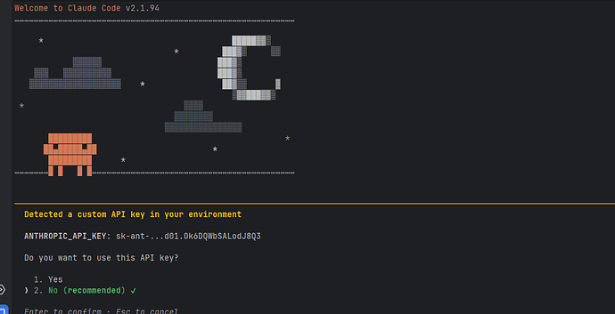
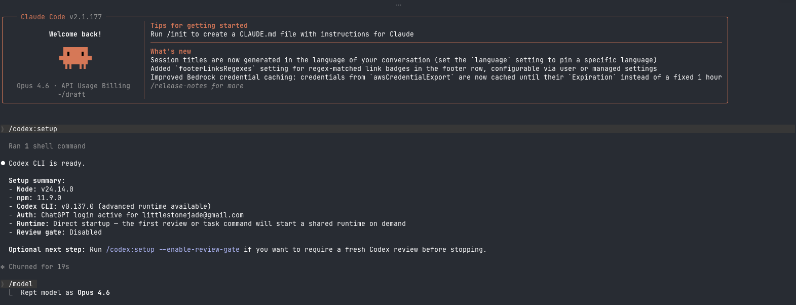
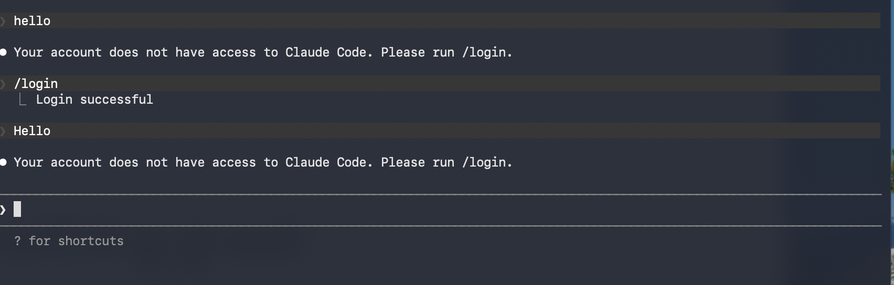

## Using Third-Party Models

### Set Onboarding Status

Edit `~/.claude.json` and set `hasCompletedOnboarding` to `true`:

```json
{ "hasCompletedOnboarding": true }
```

### Configure Custom Models

Add the `env` field in `~/.claude/settings.json` to point all default models to your third-party model:

```json
{
  "env": {
    "ANTHROPIC_DEFAULT_HAIKU_MODEL": "claude-opus-4-6-thinking",
    "ANTHROPIC_DEFAULT_OPUS_MODEL": "claude-opus-4-6-thinking",
    "ANTHROPIC_DEFAULT_SONNET_MODEL": "claude-opus-4-6-thinking"
  }
}
```

> **Note**: `claude-opus-4-6-thinking` is just an example. You **must** replace it with the actual model name supported by your third-party provider, otherwise it will not work.


Need select Yes



### Set Environment Variables

Add the following to `~/.zshrc`:

```bash
export ANTHROPIC_BASE_URL=xxx
export ANTHROPIC_API_KEY=yyy
```

- `ANTHROPIC_BASE_URL`: Replace with the real API endpoint of your third-party provider.
- `ANTHROPIC_API_KEY`: Replace with the actual API key from your third-party provider.

Run `source ~/.zshrc` to apply the changes, then restart Claude Code.

---

## Integrating the OpenAI Codex Plugin

Run the following commands sequentially in Claude Code:

```bash
# 1. Add the plugin marketplace
/plugin marketplace add openai/codex-plugin-cc

# 2. Install the plugin
/plugin install codex@openai-codex

# 3. Reload all plugins
/reload-plugins

# 4. Login and configure (skip if Codex CLI is already installed)
# /codex:setup
```

Once installed, you can call OpenAI models via Codex directly from Claude Code.



### Troubleshooting

If you encounter login issues, make sure your Codex CLI is properly authenticated:



> Note: The images in this post are sourced from the web for illustration purposes.
