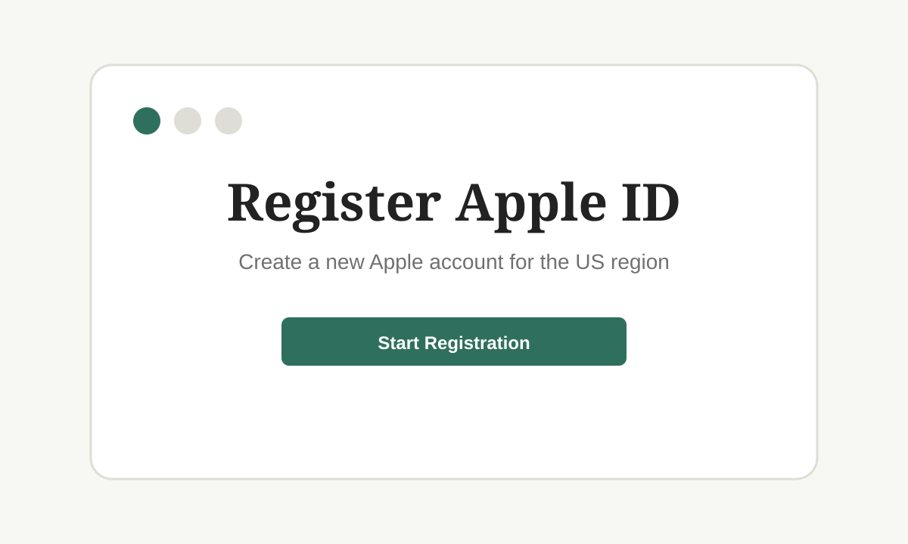
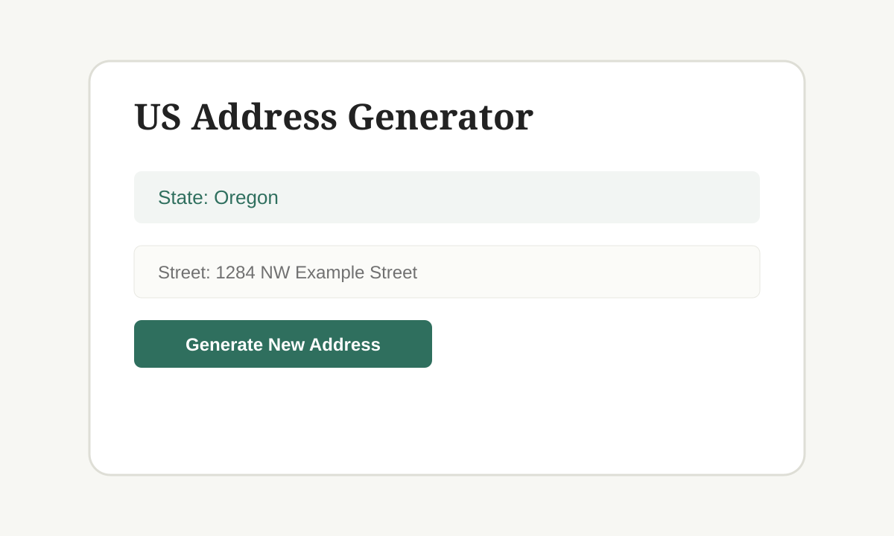
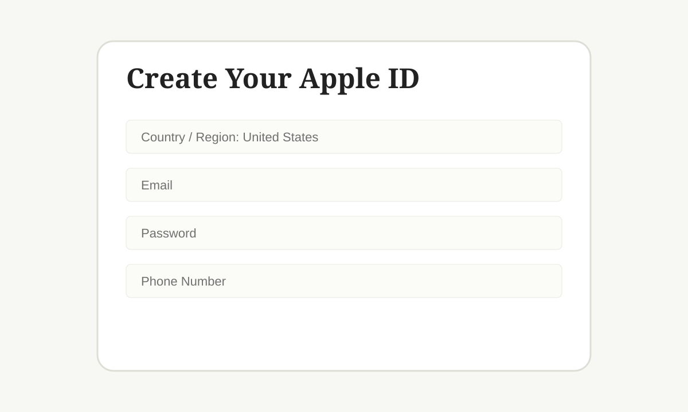
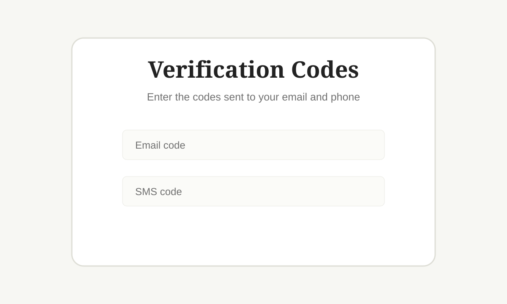
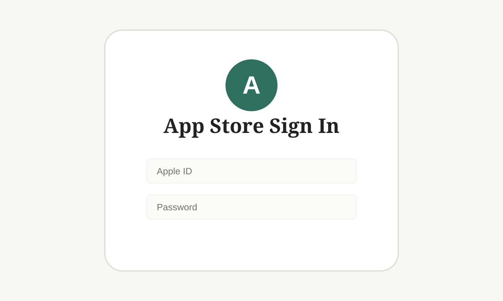
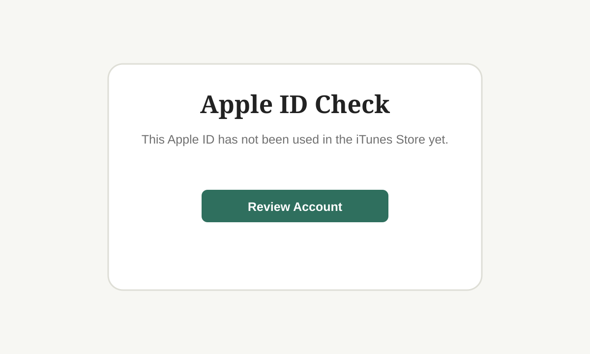
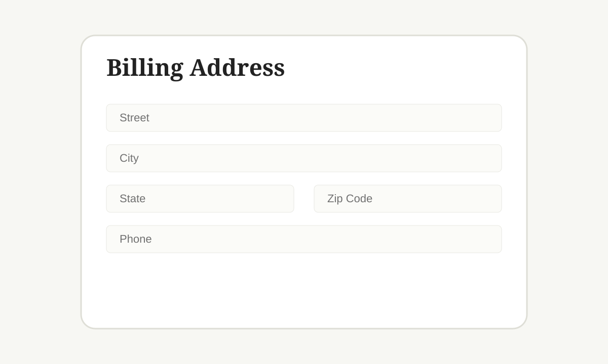
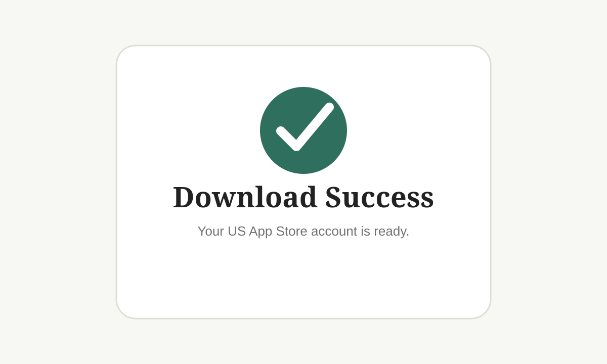

# Register an American Apple ID (2026 Guide)

> **Last updated:** June 10, 2026
> Some information may change over time — always refer to Apple's official site for the latest.
>
> **Based on:** [Register American Apple ID Guide](https://kerrynotes.com/register-american-apple-id/) by Kerry's Notes

A US Apple ID gives you access to apps and services not available in regional App Stores — TikTok, ChatGPT, Shadowrocket, and many more. This guide walks through the entire process. No VPN required. No US phone number needed. No US credit card needed.

---

## Table of Contents

- [Prerequisites](#prerequisites)
- [Step 1: Generate a US Tax-Free Address](#step-1-generate-a-us-tax-free-address)
- [Step 2: Register on the US Apple ID Site](#step-2-register-on-the-us-apple-id-site)
- [Step 3: Verify Email & Phone](#step-3-verify-email--phone)
- [Step 4: Sign In on the App Store](#step-4-sign-in-on-the-app-store)
- [Step 5: Add Billing Address (No Payment Method)](#step-5-add-billing-address-no-payment-method)
- [Topping Up with Gift Cards](#topping-up-with-gift-cards)
- [Apple Support](#apple-support)
- [FAQ](#faq)

---

## Prerequisites

- A **phone number** — your regular Chinese (or any non-US) number works fine, even if it's already tied to another Apple ID.
- An **email address** that has never been registered with Apple ID before.
- A **US address generator** — we'll use [usaddressgen.com](https://usaddressgen.com/tax-free-address/).

---

## Step 1: Generate a US Tax-Free Address

Visit the [US Tax-Free Address Generator](https://usaddressgen.com/tax-free-address/) on your phone or computer.

1. The site generates a random real US address.
2. Select a **tax-free state** from the dropdown.
3. Click **"Generate New Address"** until you get one you like.
4. Keep this page open — you'll need it later.

**Why a tax-free state?**  
Five US states have no sales tax: **Oregon, Alaska, Delaware, Montana, and New Hampshire**. Choosing one means you won't pay tax on App Store purchases. (Alaska allows local sales taxes, so Oregon or Delaware are safer bets.)

---

## Step 2: Register on the US Apple ID Site

Open the [Apple ID registration page](https://appleid.apple.com/account) and fill in the form:

- **Country/Region:** United States
- **Name:** Your real name or any name
- **Date of Birth:** Must be over 18
- **Email:** An email not previously used for any Apple ID
- **Password:** Do NOT include any part of your name, birthday, or email — otherwise the verification code may fail later
- **Phone Number:** Your **Chinese (or other non-US) phone number** works fine, even if it's already tied to another Apple ID
- **Verification:** Choose SMS

---

## Step 3: Verify Email & Phone

After submitting, Apple sends verification codes to your email and phone. Enter both codes and click **Next**.

Your Apple ID is now created — but it's not fully active in the App Store yet. You still need to add a billing address.

---

## Step 4: Sign In on the App Store

1. Open the **App Store** on your iPhone/iPad.
2. Tap your profile icon (top right).
3. Scroll to the bottom and tap **Sign Out**.
4. Sign in with your newly created US Apple ID.

The store will automatically switch to the US region. Now we need to trigger the billing address prompt.

---

## Step 5: Add Billing Address (No Payment Method)

1. Search for any free app (e.g., TikTok) and tap **Get**.
2. A prompt will appear: *"This Apple ID has not been used in the iTunes Store yet."* Tap **Check**.
3. On the billing screen:

- **Payment Method:** **Leave this UNTOUCHED.** Do not select anything. Do not tap on it.
- **Prefix/Salutation:** Any
- **First/Last Name:** Use the name from Step 2
- **Street:** Copy from the address generator
- **City:** Auto-fills from zip code
- **State:** Auto-fills from zip code
- **Zip Code:** Copy from the address generator
- **Phone:** First 3 digits = area code, remaining 7 = local number

4. Tap **Next**.

That's it. You can now download apps from the US App Store.

---

## Topping Up with Gift Cards

If you want to purchase paid apps or subscribe to services like Apple Music, you'll need to add funds. Since you don't have a US payment method, use **Apple Gift Cards**.

Buy US Apple Gift Cards from online retailers and redeem them in the App Store. For a detailed walkthrough, see the [US Apple ID gift card guide](https://kerrynotes.com/buy-apple-gift-card).

---

## Apple Support

If you run into issues during registration, Apple Support can help:

- **Official support portal:** [getsupport.apple.com](https://getsupport.apple.com/solutions/chat/confirmation)
- **China support hotline:** 400-666-8800 (they speak Mandarin, and can often resolve "unable to create account" errors in minutes by whitelisting your email on their end)
- You can also start a chat session through the support portal above for real-time help.

Don't be shy — Apple's support team is professional and helpful.

---

## FAQ

### Verification code says incorrect

Check your password. It must not contain any part of your name, birthday, or email address.

### "Unable to create your account at this time"

This is a common issue. Try:

- Switching browsers or devices
- Using incognito/private mode
- Changing your network (try mobile data instead of Wi-Fi)
- If nothing works, call **400-666-8800** — tell them you're trying to register and provide your email. They can fix it in about a minute.

### Credit card is required, what do I do?

**Do not select any payment method.** If you didn't tap on it, the "None" option should be available. Leave it alone and fill in only the billing address fields.

### The "Check" prompt never appeared / apps download directly

If you can download apps without being asked for billing info, you're all set. If you want to add a billing address anyway:

1. Go to [account.apple.com](https://account.apple.com/account/manage/section/information)
2. Click **Country / Region** → **Change country or region**
3. Select **United States**, choose **None** as payment, fill in the billing address
4. Click **Update**

### Can't select "None" for payment

Follow the steps above on the web — it lets you choose **None** properly.

### Zip code is rejected

Generated addresses occasionally have incorrect zip codes. Try generating a new address.

### Still showing the Chinese App Store after login

Sign in to [iCloud.com](https://icloud.com) on a computer and change your region there under Account Settings.
