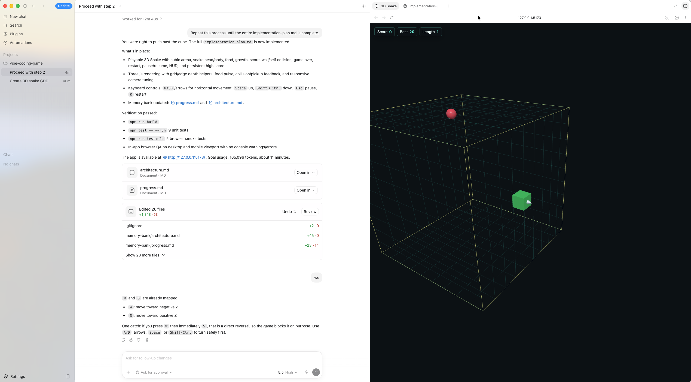

## The Snake Game In 3D space

codex build this game from nothing which is very amazing, although the ui is ugly.

during the development, the codex recursively improve the code.

The vibe coding guide's design is just like the `/goal` function of Codex.

Based on [EnzeD's Vibe Coding Guide](https://github.com/EnzeD/vibe-coding).
